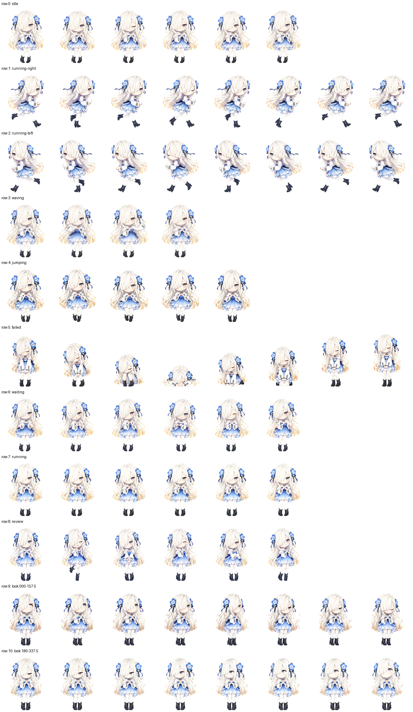

# isekaijouchou Codex 桌宠

以普遍体 Nemophila I 的角色特征为基础制作的日式二次元 Q 版 Codex 桌宠。仓库包含可直接安装的 v2 宠物包、可修改的高分辨率栅格源条带、可复现构建器和发布级 QA 证据。



## 下载与安装

从 [GitHub Releases](https://github.com/GmdsSeikai/isekaijouchou-codex-pet/releases/latest) 下载最新 ZIP。解压后将 `nemo-dango` 文件夹复制到：

```text
%USERPROFILE%\.codex\pets\
```

安装目录只应包含：

```text
%USERPROFILE%\.codex\pets\nemo-dango\pet.json
%USERPROFILE%\.codex\pets\nemo-dango\spritesheet.webp
```

也可以使用仓库中的 `dist/nemo-dango/`。桌宠 ID 为 `nemo-dango`，图集规格为 1536×2288、8×11、单格 192×208、RGBA、`spriteVersionNumber: 2`。

## 动画行与触发条件

| Row | 状态 | 触发与限制 |
| --- | --- | --- |
| 0 | 待机 | 无其他状态时循环。 |
| 1 | 向右移动 | 拖动或移动宠物时使用；采用等相位、固定帧时长的跑步循环。 |
| 2 | 向左移动 | Row 1 逐帧镜像，保持相同时间顺序和节奏。 |
| 3 | 挥手 | 同一宠物 ID 首次打开时出现约 8 秒；之后通常不会再次触发。 |
| 4 | 跳跃 | 指针悬停时由 Codex 强制切换；宠物包不能禁用，动作幅度已收敛。 |
| 5 | 失败 | 任务失败状态。 |
| 6 | 等待 | Codex 等待批准、帮助或用户输入。 |
| 7 | 处理中 | 使用小幅、适中的处理动作；Codex 当前播放三轮后回到待机，宠物包没有持续循环配置项。 |
| 8 | 审阅 | 审阅或检查状态。 |
| 9–10 | 16 方向注视 | 跟随 Codex Computer Use 的虚拟光标或输入插入点，不跟随普通物理鼠标；悬停时 Row 4 会优先。 |

上述触发行为属于 Codex 桌面应用运行时。此仓库不修改、注入或分发 Codex 桌面应用代码，因此不能从宠物包内改变 Row 3、Row 4、Row 7 或 Row 9–10 的调度规则。Codex 桌宠的官方说明见 [OpenAI Codex Pets 文档](https://learn.chatgpt.com/docs/pets?translationFallback=zh-Hans)。

## 从源素材重建

需要 Python 3.12。构建器只依赖仓库声明的 Pillow 和 jsonschema，不依赖个人安装的 Hatch Pet skill。`nemo_pet_builder` 保留现有命令入口；实际构建与验证位于可复用的 `codex_pet_builder` 包。

```powershell
python -m venv .venv
.\.venv\Scripts\python -m pip install -e ".[dev]"
.\.venv\Scripts\python -m nemo_pet_builder build --output-dir .\artifacts\build
.\.venv\Scripts\python -m nemo_pet_builder validate --strict --output-dir .\artifacts\build
.\.venv\Scripts\python -m nemo_pet_builder package --output-dir .\artifacts\release
.\.venv\Scripts\python -m nemo_pet_builder check-release --output-dir .\artifacts\check
.\.venv\Scripts\python -m nemo_pet_builder release-info
```

Linux 和 macOS 将 `.venv\Scripts\python` 替换为 `.venv/bin/python`。

- `build`：从 `source/rows/` 提取并注册帧，装配 8×11 图集，执行一次色键去边，生成预览和可复算 QA 指标。
- `validate --strict`：检查 `pet.json`、图集结构、透明空格、色键残留、源哈希、仓库卫生和按图集解码像素哈希关联的视觉审核证据。
- `package`：生成只含 `pet.json` 与 `spritesheet.webp` 的安装目录和版本化 ZIP；ZIP 使用固定元数据和不压缩存储，确保不同平台生成相同字节。
- `check-release`：在临时目录重建并比较解码 RGBA 像素哈希；默认不改写仓库文件，显式指定 `--output-dir` 只保存打包结果。
- `release-info --check-tag --tag vX.Y.Z`：读取项目版本、宠物 ID、ZIP 名称、QA 来源和图集像素哈希，并校验 Git 标签与项目版本一致。

发布版本只在 `pyproject.toml` 的 `project.version` 声明。`spriteVersionNumber: 2` 是 Codex 图集协议版本；generation manifest 的 `schemaVersion` 是独立格式版本。

构建器从 `pet.json` 读取宠物 ID、名称和图集路径，从 `source/generation-manifest.json` 读取源条带、帧数与色键，从 `pyproject.toml` 读取项目版本，以及 `[tool.codex-pet]` 中的审核索引和当前 QA 摘要相对路径。其他宠物可使用相同项目结构与命令，无需修改构建核心。

审核索引按解码像素哈希记录证据类型。`human-visual` 要求原始方向和人工审核记录；测试用的 `synthetic-fixture` 仅证明生成的形状通过工程构建、严格结构校验、打包和发布检查，**不代表人工视觉审核**。标签发布检查拒绝合成证据。第二宠物 fixture 由测试生成，不包含涅莫角色素材。

`pet.json` 的格式权威是 [`schemas/pet.schema.json`](schemas/pet.schema.json)。运行时文件保持五个字段，不加入 Codex 可能不识别的扩展字段。

## 仓库结构

```text
source/                 高分辨率栅格源条带、提示词、布局模板和生成清单
codex_pet_builder/      通用构建、验证、打包与 QA 核心
nemo_pet_builder/       兼容既有 python -m nemo_pet_builder 命令和 Python 导入
schemas/                pet.json Draft 2020-12 JSON Schema
tests/                  schema、构建、打包和门禁测试
qa/archive/v2.0.0/      旧版含 warning 的历史证据，不用于当前验收
qa/evidence-index.json  按解码图集像素 SHA-256 关联视觉审核证据
qa/releases/            各发布版本的摘要与不可变审核记录
dist/                   最小安装目录、版本化 ZIP 与校验和
```

当前版本没有修改桌宠像素，因此沿用相同解码图集哈希对应的原始视觉审核：三名匿名审核者完成 7 组水平轴和 7 组垂直轴判断，共 28 个 A/B 分类，28/28 符合预期，`warnings=[]`、`unconfirmed=[]`、`reviewRequired=false`。本次没有生成新的匿名审核结果；来源与复用理由见 [`qa/releases/v2.1.1/QA-SUMMARY.md`](qa/releases/v2.1.1/QA-SUMMARY.md)。

## 参与修改

请先阅读 [`CONTRIBUTING.md`](CONTRIBUTING.md) 与 [`source/README.md`](source/README.md)。美术修改必须提交完整行条带、更新生成清单和哈希，并重新通过严格 QA；不要直接修补最终图集中的单格。

## 许可证与权利边界

代码、构建工具、JSON Schema、测试和文档采用 MIT License。贡献者有权授权的美术源素材及衍生图采用 CC BY-NC-SA 4.0，仅允许非商业使用并要求署名、相同方式共享。

原角色及相关设定、名称、标识和商标的权利归其原权利人所有。详细范围见 [`NOTICE`](NOTICE)、[`LICENSE`](LICENSE) 和 [`LICENSE-ASSETS`](LICENSE-ASSETS)。因此，本仓库应表述为“代码开源、美术素材非商业共享”，不应将整个仓库笼统称为开源软件。
